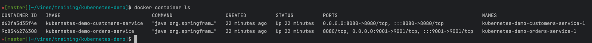
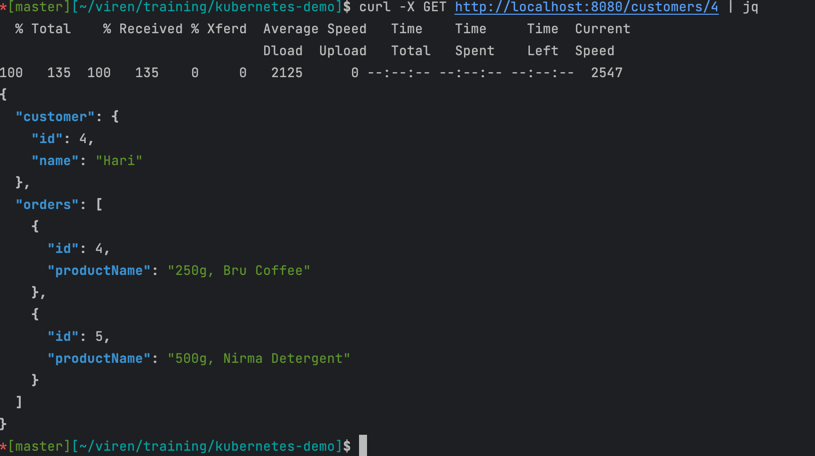
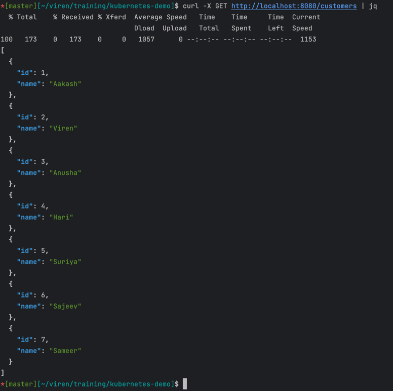
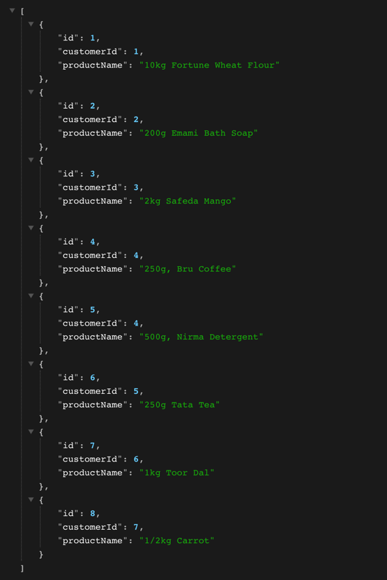

# A sample set up to test app deployment on kubernetes.

Salient features of app are as follows ;

- Two functioning apps (**customers** & **orders**)
- In both the apps,data persisted thus powered by embedded H2 database.
- Business and data view in both the apps are kept minimal since the motive here is to validate their 
  deployments on kubernetes.
- **orders** app functions as a dependent app on **customers** as in a business sense, customer's orders are 
  enquired from orders service (HTTP client is exercised in customers app).

## How to interact with apps.

- Prerequisites : Java17 , docker, curl, docker-compose, colima/docker desktop & jq.
- Clone the repository on local machine.
```html
$ cd <path_to_project_dir>/kubernetes-demo
$ docker-compose up  #first time it'll take a few minutes to finish.
```
- Validate 2 containers should come up.
```html
$ docker containers ls
```

- Validate success for a few curls
```html
$ curl -X GET http://localhost:8080/customers/4 | jq
```

```html
$ curl -X GET http://localhost:8080/customers | jq
```

```html
$ curl -X GET http://localhost:9001/ | jq
```


- Manufacture delay
```html
$ curl --location 'http://localhost:8080/customers/4?delayInMs=5000' | jq
  % Total    % Received % Xferd  Average Speed   Time    Time     Time  Current
                                 Dload  Upload   Total   Spent    Left  Speed
100   135  100   135    0     0    131      0  0:00:01  0:00:01 --:--:--   132
{
  "customer": {
    "id": 4,
    "name": "Hari"
  },
  "orders": [
    {
      "id": 4,
      "productName": "250g, Bru Coffee"
    },
    {
      "id": 5,
      "productName": "500g, Nirma Detergent"
    }
  ]
}
```
- Manufacture failure
```html
$ curl --location 'http://localhost:8080/customers/8' | jq               
  % Total    % Received % Xferd  Average Speed   Time    Time     Time  Current
                                 Dload  Upload   Total   Spent    Left  Speed
100  2006  100  2006    0     0  19736      0 --:--:-- --:--:-- --:--:-- 21569
{
  "timestamp": "2023-05-10T16:56:43.562+00:00",
  "path": "/customers/8",
  "status": 400,
  "error": "Bad Request",
  "message": "Supply valid customer id.",
  "requestId": "a149a881-16"
}

$ curl -X POST http://localhost:8080/error/503 | jq
% Total    % Received % Xferd  Average Speed   Time    Time     Time  Current
Dload  Upload   Total   Spent    Left  Speed
100 10148  100 10148    0     0  53518      0 --:--:-- --:--:-- --:--:-- 57011
{
"timestamp": "2023-05-11T06:43:21.872+00:00",
"path": "/error/503",
"status": 503,
"error": "Service Unavailable",
"message": null,
"requestId": "d18c4628-1"
}
```
## Kubernetes Deployment

- On local - Prerequisites: minikube, kubectl
- Up minikube kubernetes cluster on your local
- Verify minikube status 
```html
$ minikube status

minikube
type: Control Plane
host: Running
kubelet: Running
apiserver: Running
kubeconfig: Configured
```
- From project's root , run ;
``$ kubectl apply -f kube``
- Post successful response from above command, validate pods
```html
$ kubectl get pods -o wide

NAME                             READY   STATUS    RESTARTS   AGE    IP            NODE       NOMINATED NODE   READINESS GATES
customers-5ddb75b6f6-qxqng       2/2     Running   0          34m    10.244.0.17   minikube     <none>           <none>
orders-75f7bd96d6-jxsh8          2/2     Running   0          34m    10.244.0.18   minikube     <none>           <none>
```
- Validate service instances for customers & orders pods.
```html
$ kubectl get svc
NAME          TYPE           CLUSTER-IP       EXTERNAL-IP     PORT(S)        AGE
customers     LoadBalancer   10.98.243.74     192.168.64.11   80:31522/TCP   38m
orders        ClusterIP      10.100.59.251    <none>          9001/TCP       38m
```
- Mind the service type for customers service, A LoadBalancer type.
- Get the URL for customers service.
```html
$ minikube service customers --url

http://192.168.64.2:31522
```
- Verify the customers service health by accessing http://192.168.64.2:31522/actuator/health
- Validate aforementioned customers APIs results. 
- Since orders service is not exposed to the public ,therefore remains inaccessible.
